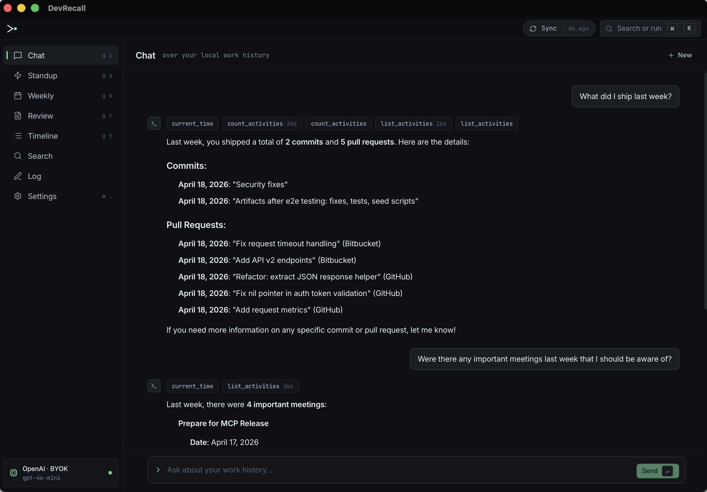
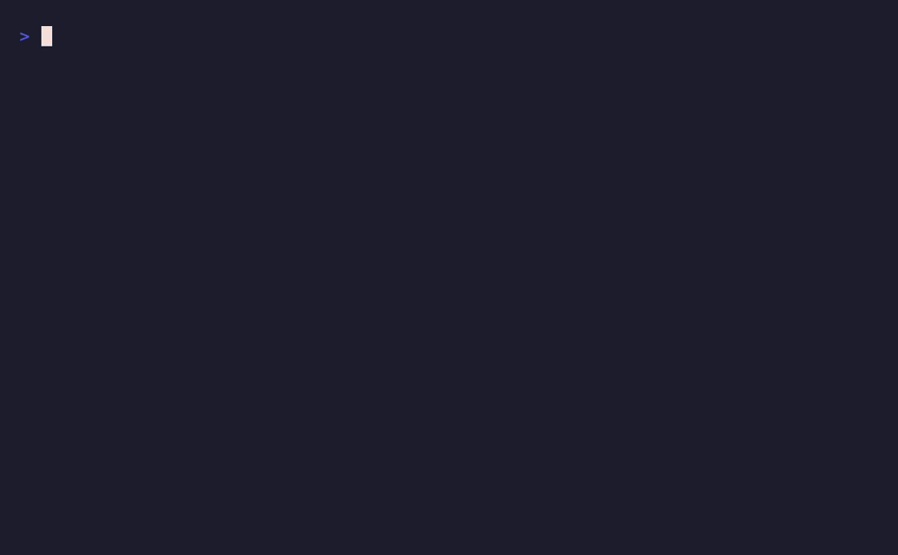
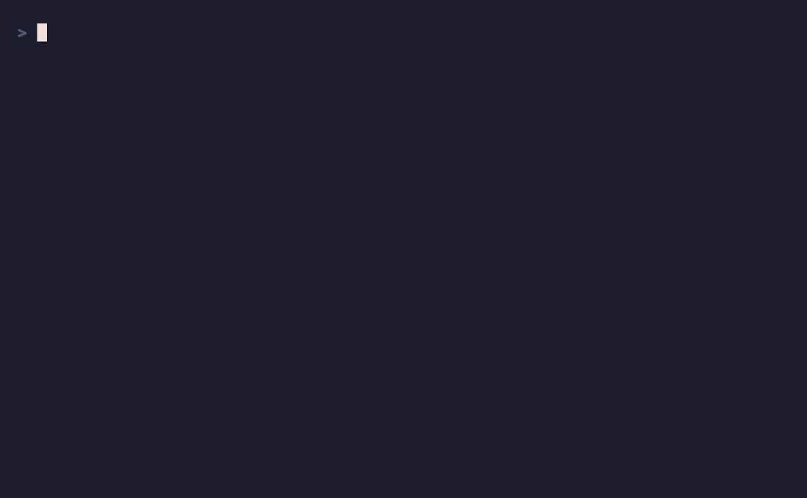

# DevRecall

**Your developer activity, aggregated on-device.** No cloud sync. No telemetry.
Your data never leaves your machine.

DevRecall pulls from Git, Slack, Google Calendar, Jira, Linear, Confluence,
and GitHub/GitLab/Bitbucket; stores it in a local SQLite database; and turns
it into standups, weekly reports, brag docs, and a chat that actually knows
what you worked on.

Also ships an [MCP server](https://docs.devrecall.dev/integrations/mcp/) —
any MCP-compatible coding tool (Claude Code, Cursor, Codex, Continue, Zed)
can spawn it as a stdio subprocess and gain memory of everything you've
shipped. `/devrecall:recall what auth bug did I fix in February` returns
cited commits, PRs, and tickets inline.

<table>
  <tr>
    <td align="center" width="33%">
      <a href=".github/assets/chat.jpg"></a><br>
      <sub>Desktop app — the same memory, native UI</sub>
    </td>
    <td align="center" width="33%">
      <a href=".github/assets/standup.gif"></a><br>
      <sub><code>devrecall standup</code> — the day's report, written for you</sub>
    </td>
    <td align="center" width="33%">
      <a href=".github/assets/recall.gif"></a><br>
      <sub><code>devrecall chat</code> — recall with cited commits &amp; PRs</sub>
    </td>
  </tr>
</table>

📚 **[docs.devrecall.dev](https://docs.devrecall.dev)** — install, configure, integrations, CLI reference.

## Why

- **Local-first.** SQLite on your laptop. Tokens in `~/.devrecall/tokens/` (`0600`). The Cloudflare Worker relay is a pass-through for OAuth callbacks only — it never sees your data.
- **LLM-optional.** Bundled embeddings run offline (ONNX + `all-MiniLM-L6-v2`). Use local Ollama for chat, or bring your own OpenAI/Anthropic key.
- **Open source.** MIT-licensed. Audit it, fork it, build it from source.

## Sources

| Source            | What gets collected                            |
| ----------------- | ---------------------------------------------- |
| Git (local)       | Commits, branch activity, files changed        |
| GitHub / GitLab / Bitbucket | PRs/MRs, reviews, issues, comments   |
| Slack             | Your messages, threads you participated in     |
| Google Calendar   | Meetings attended, organized, declined         |
| Jira / Linear     | Issue transitions, comments, sprint membership |
| Confluence        | Pages, blogposts, and comments you authored    |

## Install

Homebrew ships with the first tagged release. Until then:

```bash
git clone https://github.com/pavelpilyak/devrecall.git
cd devrecall
make build          # → bin/devrecall
```

Requires Go 1.22+ with CGO enabled (for SQLite FTS5).

Full install + setup walkthrough at **[docs.devrecall.dev/install](https://docs.devrecall.dev/install/)**.

## Development

```bash
make build              # bin/devrecall
make test               # tests with race detector
make lint               # golangci-lint
```

Build tags: `fts5` enables SQLite full-text search; `GO` enables hugot's pure
Go ONNX backend for embeddings.

The desktop app (Tauri + Svelte) lives in [`desktop/`](desktop/);
the OAuth callback relay (Cloudflare Worker) in [`relay/`](relay/).

## Contributing

Bug reports and collector contributions are especially welcome.
See [CONTRIBUTING.md](CONTRIBUTING.md).

## Security

[SECURITY.md](SECURITY.md) for responsible disclosure.
